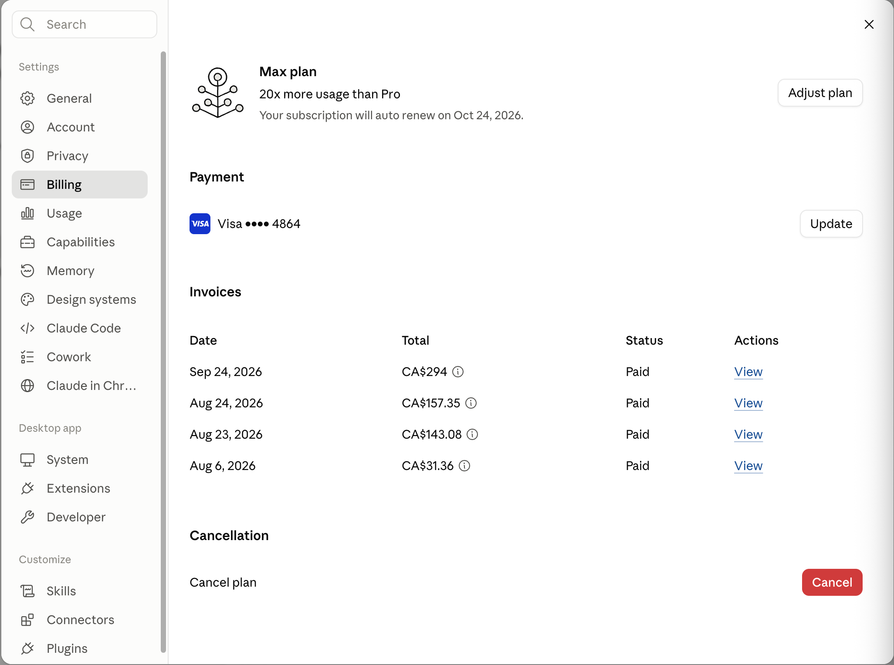
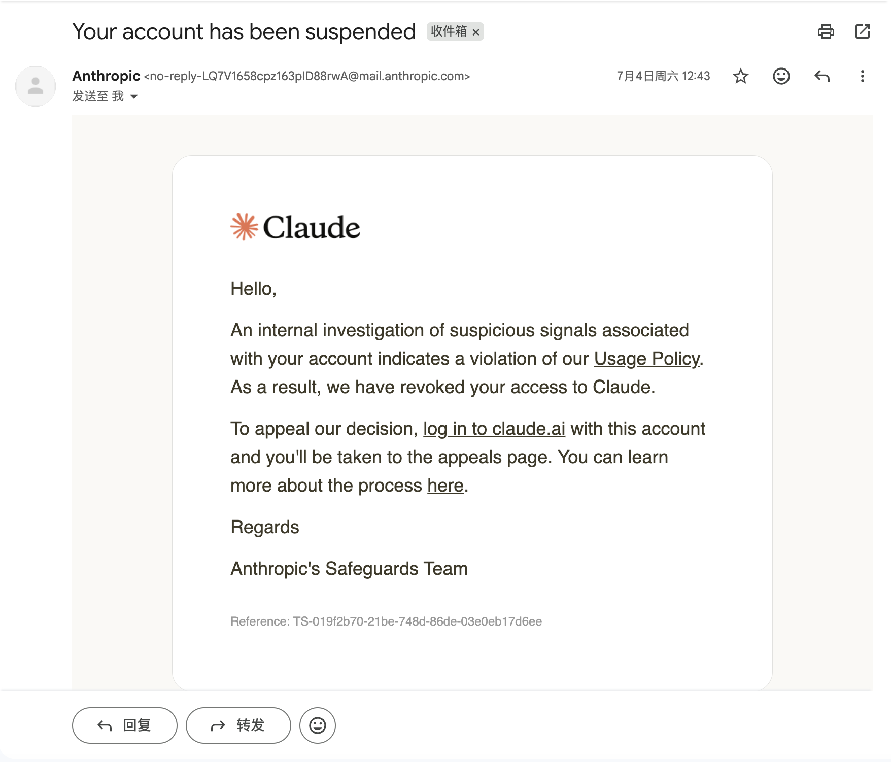

今天看了一眼工作台。我的一号员工 Claude Code，在这个新号上已经连续干满一个月， 刚并成功续费了。

这一个月，它参与了两个核心微服务的重构，改了几万行代码，也帮我翻出不少以前留下的坑。之所以专门记这个日子，是因为前两个账号在两周内先后被停用。我当时正在赶项目，工作节奏被打断得挺难受。

写一下经过。先说明：我不知道两次停用的确切原因，下面涉及原因的部分都是我的推测。

---

## 第一次：写到一半，出口从日本跳到了美国

常用邮箱注册，绑卡，开通，终端里敲 `claude`。基础档跑得很顺，代码在滚。

下午，蹬的好好的，突然，提示不能用了。打开网页，看到一行红字：Your account has been disabled。

我一脸懵。最终，我发现原本使用的日本节点，自动切到了美国。切换时间和账号停用邮件的时间几乎重合，所以我怀疑这可能是原因，但没法确定。

这次之后，我关掉了代理的自动故障转移。连接失败就报错，不再自动换到另一个地区。

---

## 第二次：新号拉满，又只打最强模型

申请第二个账号换了邮箱，沿用之前的信用卡，支付成功了。

因为项目赶进度，我直接升到最高用量档20x，连续几天主要用最强模型处理全库分析、长上下文和大段代码生成。第四天，账号再次停用。这次我没发现出口切换。

我猜测，新账号一上来就有很高的使用量，可能是影响因素。但这只是猜测，不能据此反推平台具体的风控规则，更不能说是因为用了哪个模型。

两次申诉后来都退了费。钱退回来，重构的节奏却没法退款。

---

## 第三次：出口固定，档位爬升，模型分层

第三次我做了几个调整：

- 固定网络出口，关闭自动跨地区切换。
- 从基础档开始用，实际额度不够再升级。
- 日常编写、单文件重构和修 bug 主要用 Sonnet；复杂的跨模块问题再用更强的模型。

到今天，这个账号用了一个月。我没法证明是哪项调整起了作用，也可能前两次另有原因。至少现在这套工作方式比较适合我：大多数任务不需要一开始就上最强模型，遇到真正难拆的问题再切过去。

以前我打开终端，想的是今天让它多干点。连着停用两次以后，我现在偶尔会先确认一件事：

一号员工今天还在不在岗。

[原文链接](https://hoxi.ai/blog/claude-code-account-disabled-twice)

